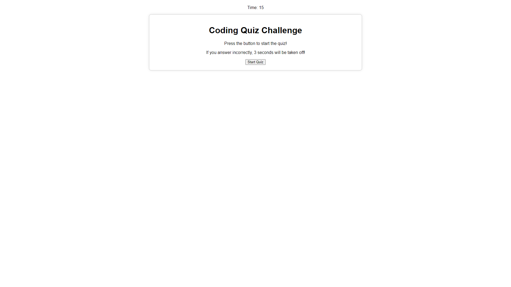
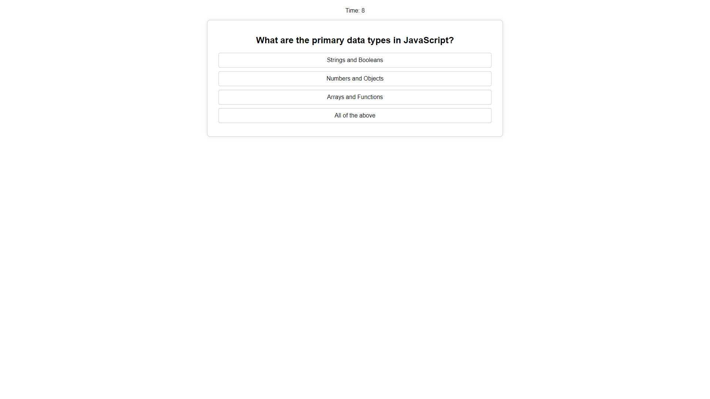

# JavaScript Timed Quiz!

#### This Week's Bootcamp Odd-Number Challenge: 
Our assignment for Week Four is to create a timed JavaScript quiz from scratch.

## Link To Website
[Click here to be re-directed!](https://callbeyond.github.io/timedquiz/ "Click here to take the quiz!")

## Usage
When you click Start, a timed quiz of 15 seconds will begin. If you answer incorrectly, 3 seconds will be deducted. There's a total of 5 questions.  

## Screenshots

## Credits

UofM-VIRT-FSF-PT-10-2023-U-LOLC-ENTG
## License

[MIT](https://choosealicense.com/licenses/mit/)
